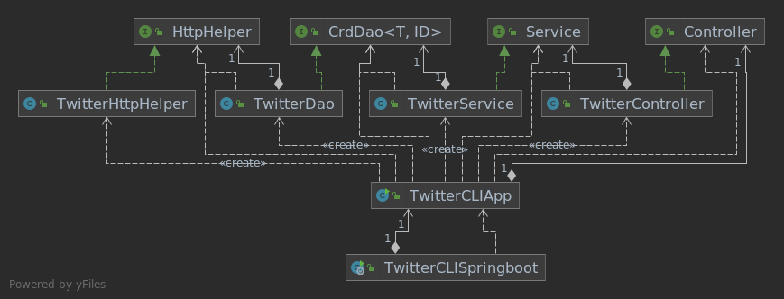

# Introduction
This Twitter application is a command line tool that utilizes Twitter's REST API to allow for
the posting, showing, and deletion of tweets. Using the Apache HTTPComponents library, it interacts 
with the Twitter REST API through OAuth 1.0. Spring Boot is used for object dependency management. JUnit is used for unit
and integration testing. Maven is used for maintaining the project lifecycle. Docker is used to distribute an image of the app through Docker Hub.
# Quick Start
```
# Package locally with Maven
mvn clean package

# Pull docker iamge
docker pull bdicicco/twitter

# Run the image with desired Twitter secrets
docker run --rm \
-e consumerKey=YOUR_VALUE \
-e consumerSecret=YOUR_VALUE \
-e accessToken=YOUR_VALUE \
-e tokenSecret=YOUR_VALUE \
bdicicco/twitter post|show|delete [options]

# Post example (post "tweet_text", "longitude:latitude"
post "test tweet" "40:20"

# Show example (show id ["field1,field2,..."])
show 123456789 ["id,text"]

# Delete example (delete "id1,id2,id3,...")
delete "123456789"
```

# Design
## UML diagram


1. **TwitterCLISpringboot**: This class utilizes the TwitterCLIApp while using Spring to enable dependency management. 
   By using autowiring of dependencies, the needed objects and instantiated and initialized. This then sends the command line arguments
   to the TwitterCLIApp for processing.
2. **TwitterCLIApp**: This class is the command line interface of the application. It processes command line arguments, and passes them 
   to the correct controller method for handling. It will then display the response to the command line.
3. **TwitterHttpHelper**: The lowest level of the application. This class executes the HTTP communication
   between the user and the Twitter API. Using the given URIs, it converts them into HTTP requests and receives the
   responses.
4. **TwitterDao**: This class is responsible for the data-access of the Tweet object. It constructs
   URIs corresponding to the method, and executes it with the TwitterHttpHelper. It then builds the corresponding POJO of the Tweet.
5. **TwitterService**: This class handles the business logic of the application. Through the use of the TwitterDao, it 
   ensures requested tweets conform to proper standards such as text length and id requirements.
6. **TwitterController**: This controller class is used to parse the command line arguments given by TwitterCLIApp, and pass them to
the service layer for processing.
   
## Models
The Tweet model used in this is application is a simplified version of the official Tweet model. It is a DTO that is 
transferred between the layers (controller, service, dao) of the application in order to process
and access tweet information. It is composed of multiple other objects (Coordinates, Entities, UserMention, Hashtag) along with
object wrappers for primitive fields. Using this pattern and structure, proper serialization and deserialization is done
on the JSON objects.

## Spring
This application uses Spring and the Inversion of Control container to maintain object dependencies. 
Using the annotations `@Component`, `@Service`, `@Controller`, and `@Bean`, Spring scans the project
and manages the dependencies for objects marked with these annotations. To do this, the `@Autowired` annotation
is also used in order to indicate the constructor that will be injected into. Traditionally, a single class or method
would maintain the creation and assignment of dependencies, but through the use of Spring, this can be simplified
and allows for scalable applications.

# Test
The app contains both unit and integration tests for each component created with JUnit. The unit tests had dependencies mocked using Mockito
to ensure that only the targeted component was being tested. The integration tests ensured that the expected
system functionality when combined performed as expected when querying the Twitter API. Altogether, both types
of tests were used to ensure the application performed according to the desired specifications.

## Deployment
1. First, a Dockerfile was created in order to make an image:
```
FROM openjdk:8-alpine
COPY target/twitter*.jar /usr/local/app/twitter/lib/twitter.jar
ENTRYPOINT ["java","-jar","/usr/local/app/twitter/lib/twitter.jar"]
```

2. Next, the image was built with the Dockerfile after packaging the app:
```
mvn clean package
docker built -t bdicicco/twitter .
```

3. Finally, the image was pushed to my Docker Hub repo:
```
docker push bdicicco/twitter
```

# Improvements
- Implement a REPL. Allow continuous requests to be sent in one session without having to rerun the program.
- Find a tweet through text content rather than just by id.
- Implement additional twitter features such as liking and retweeting tweets.