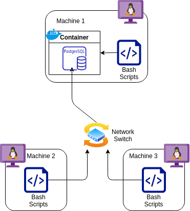

# Linux Cluster Monitoring Agent

# Introduction
The goal of this project was to develop a minimum viable product (MVP) that would automatically collect and store hardware information. The data comes from a cluster of internally connected Linux machines. The potential users include the Jarvis Linux Cluster Administration (LCA) team, along with anyone that would need to collect this data, such as network administrators. The project's core is the set of bash scripts that collect the hardware data continuously using the crontab command. A PostgreSQL Docker container stores all of the data; This allows the database system to be portable and fit any Linux machine. The version control system uses Git to manage the development, along with this GitHub repository for storage.
# Quick Start
Start a PSQL instance using **psql_docker.sh**:

`bash ./scripts/psql_docker.sh create | start | stop  [db_username] [db_password]`

Create the PSQL database tables using **ddl.sql**:

`psql -h psql_host -U psql_user -d database_name -f sql/ddl.sql`

Insert the host hardware specifications into the database using **host_info.sh**:

`bash ./scripts/host_info.sh psql_host psql_port db_name psql_user psql_password`:

Insert the host hardware usage information into the database using **host_usage.sh**:

`bash ./scripts/host_usage.sh psql_host psql_port db_name psql_user psql_password`

Setup **crontab** to run the usage gathering script every minute:

```
crontab -e
* * * * * bash /full/path/to/linux_sql/scripts/host_usage.sh 
psql_host port db_name psql_user psql_password &> /tmp/host_usage.log
```

# Implementation
The basis of this project is the bash scripts. These scripts run on the host machines to collect hardware data and are detailed in the "Scripts" section. To help with the collection of this data, a Docker PostgreSQL container is created on one machine. All of the data is fed into that container and stored in the PSQL database. The usefulness of this data and what exactly it entails is detailed further on.

## Architecture


## Scripts
`psql_docker.sh`

This shell script has three commands:
1. Create a PSQL docker container
`bash ./scripts/psql_docker.sh create db_user db_password`
2. Start the existing container 
`bash ./scripts/psql_docker.sh start` 
3. Stop the existing container
`bash ./scripts/psql_docker.sh stop`
   
`host_info.sh`

This shell script is responsible for gathering the hardware specifications of the host
machine and adding it to the PSQL database. The data collected is outlined in the "Database Modeling" section. This script
must be run after `ddl.sql` and before `host_usage.sh`. Execute the script with:

- `bash ./scripts/host_info.sh psql_host psql_port db_name psql_user psql_password`

`host_usage.sh`

This shell script is responsible for gathering the hardware usage statistics from the host machine.
The data collected can be seen in the "Database Modeling" section. This script requires `host_info.sh`
to be run prior. Execute the script with:

- `bash ./scripts/host_usage.sh psql_host psql_port db_name psql_user psql_password`

`crontab`

Crontab is used to execute `host_usage.sh` every minute in order to constantly collect the 
hardware usage data. This is done by:
```
# Launch the crontab editor
crontab -e

# Set script to run and log results every minute
* * * * * bash /full/path/to/linux_sql/scripts/host_usage.sh 
psql_host port db_name psql_user psql_password &> /tmp/host_usage.log
```

`queries.sql`

The three queries available in this file answer some relevant business questions regarding resource planning and system management:
1. The first query lists all monitored hosts by the number of CPUs and memory size. This allows analysis of currently available resources.
2. The second query retrieves the average memory used by each host over a 5-minute interval. This is useful, and it allows analysis of usage and time patterns. For example, a network admin can see when each machine is most used and determine when the load is highest and lowest for load balancing.
3. The third query determines how many data points are collected from host_usage.sh in every 5-minute interval. Since the script is supposed to collect information every minute, if less than 3 data points were collected, it can be assumed the host system is failing and requires maintenance.


## Database Modeling
#### Schema for 'host_info'

Attribute | Type | Description
--------- | -----| -----------
id | serial | Unique automatically incremented number to identify each host. Primary key.
hostname | varchar |  Unique name for every host.
cpu_number | smallint | The number of CPU cores.
cpu_architecture | varchar | The type of architecture of the processor.
cpu_model | varchar | Name of CPU model.
cpu_mhz | decimal | CPU clock speed in MHz.
l2_cache | integer | L2 memory cache size in kB.
total_mem | integer | Size of total memory (RAM) in kB
timestamp | timestamp | The time when this record was collected.

#### Schema for 'host_usage'

Attribute | Type | Description
--------- | -----| -----------
timestamp | timestamp | The time when this record was collected.
host_id | integer | ID corresponding to the same host in the 'host_info' table. Foreign key.
memory_free | integer | The amount of available memory (RAM).
cpu_idle | smallint | Percentage of time that the CPU spends idle.
cpu_kernal | smallint | Percentage of time that the CPU spends running in kernal mode.
disk_io | integer | The number of disk input/out processes.
disk_available | integer | Root directory disk space available in MB.

# Testing
Due to being an MVP, I only tested a single machine instance. The assumption of the scripts working in a Linux
cluster that is connected properly was made. 

### Bash Scripts Testing
- The scripts (`psql_docker.sh`, `host_info.sh`, and `host_usage.sh`) were manually tested on a single machine. These tests used 
the Linux shell.
- Bash options such as `bash -x` were used. This one allowed the execution of the script to be seen and was useful for debugging.
- The scripts that collected data (`host_info.sh` and `host_usage.sh`) were verified by checking the 
database tables after execution.
- `psql_docker.sh` was tested using Docker CLI. After creating the PSQL container, it was verified to exist and run by accessing it.
### SQL Testing
- `ddl.sql` was verified by viewing the database tables using the database view of IntelliJ. The PostgreSQL terminal
was also used to list the tables the database contained.
- `queries.sql` was tested by inserting test data into the databases and verifying the queries results manually by calculating
the expected results, and the ones that were returned.
# Deployment
Due to the project scope and nature, deployment isn't necessary. Git and GitHub manages the source-control management, 
and Docker containers manage the PSQL instance. 

# Improvements
As an MVP, many improvements can be made. Some of these include:

- Implement a single bash script that automates the entire process. The script would 
  retrieve and create the Docker PSQL container, start it, and construct the tables using the DDL schemas. 
- Create an alert to notify the users immediately when the SQL queries detect system failure.  
- Create a backup storage mechanism. At the moment, a single machine contains the database.  
